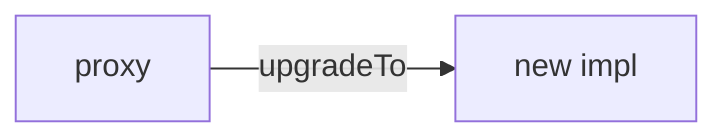

# Nex Labs Capital Protected Note Index

> **Balanced exposure to crypto upside & TradFi stability – delivered on‑chain**

---

## 1  Overview
Nex Labs introduces a *hybrid* on‑chain index that fuses the growth potential of the **Crypto5 (CR5) basket** – the 5 largest crypto‑assets by market‑cap – with the downside protection and yield of **bERNX**, an ERC‑20 that tokenises the iShares € Ultrashort Bond ETF (ERNE).

The resulting ERC‑20 index token offers

* **Crypto Upside**   – exposure to market‑leading digital assets.
* **Stable Yield**     – euro‑denominated, investment‑grade ultrashort bonds.
* **Full Composability** – both components live on‑chain; the index integrates with any DeFi stack.

This README documents the smart‑contract suite, rebalancing flow, and local development workflow.

---

## 2  Repository Structure
```
contracts/
 ├─ factory/
 │   ├─ IndexFactory.sol           ▸ user‑facing issuance / redemption orchestrator
 │   ├─ IndexFactoryStorage.sol    ▸ persistent storage / round book‑keeping
 │   └─ FunctionsOracle.sol        ▸ Chainlink Functions powered component oracle
 ├─ token/
 │   └─ IndexToken.sol             ▸ ERC‑20 for the hybrid index
 ├─ SCA/
 │   └─ StagingCustodyAccount.sol  ▸ escrow & batch‑settlement account
 └─ utils/
     └─ Vault.sol                  ▸ component vault governed by operators

script/   ▸ deployment & upgrade scripts
test/     ▸ Foundry test‑suite
```

---

## 3  Key Contracts
| Contract | Role |
|----------|------|
| **IndexFactory** | Entry‑point for users. Handles deposits, cancellation, and redemption requests; writes intent into **IndexFactoryStorage**. |
| **IndexFactoryStorage** | Round‑based order book (issuance & redemption), fee config, and shared state. Upgradable via UUPS. |
| **StagingCustodyAccount** | Escrows USDC (issuance) or IDX (redemption) and performs batched on‑chain settlement after the off‑chain bot executes trades. |
| **IndexToken** | ERC‑20 representing a proportional claim on the hybrid index. Minted/Burned only by SCA. |
| **FunctionsOracle** | Fetches CR5 constituents / weights from off‑chain & exposes them to contracts. |
| **Vault** | Holds portfolio components; `nexBot` (operator) can withdraw proportional slices for swaps. |

---

## 4  Flow Diagrams

### 4.1 Issuance
1. User calls `IndexFactory.issuanceIndexToken(amount)`.
2. USDC is transferred to **SCA**; fee sent to `feeReceiver`.
3. `IndexFactoryStorage` records the deposit in the *current issuance round*.
4. When the round closes, the bot calls `SCA.issuanceAndWithdrawForPurchase()` which:
   * swaps 20 % of the USDC to components via `issuanceCrypto5()`
   * forwards 80 % to the bot for bERNX purchase
   * bumps `currentRoundId`.
5. After trades clear, bot sends freshly bought components to SCA; SCA mints IDX and distributes pro‑rata in `distributeTokens()`.

### 4.2 Redemption
1. User calls `IndexFactory.redemption(amount)`; IDX is escrowed in **SCA** and recorded in the *current redemption round* (`redemptionRoundId`).
2. When the round closes the bot:
   * asks **Vault** to withdraw the same % of every component as the % of supply that will be burned.
   * swaps components → USDC off‑chain.
   * calls `SCA.settleRedemption(roundId, usdcReceived)`.
3. SCA receives USDC, pays each redeemer, burns the IDX escrowed for them, and tells `IndexFactoryStorage` to `settleRedemption`.

---

## 5  Hybrid Rebalancing Strategy
* **Base weights**  CR5 20 %  |  bERNX 80 %.
* **Adaptive rules** (evaluated by the oracle off‑chain):
  * CR5 vol > 40 % → ‑5 % CR5 / +5 % bERNX
  * bERNX yield > 3.5 % → ‑5 % CR5 / +5 % bERNX
  * CR5 vol < 25 % *and* yield < 2 % → +10 % CR5 / ‑10 % bERNX

---

## 6  Getting Started
```bash
# 1. Install deps
forge install

# 2. Copy env & set private key / RPCs
cp .env.example .env

# 3. Run tests
forge test -vvv

# 4. Deploy to a testnet (example):
forge script script/Deploy.s.sol:Deploy --rpc-url $SEPOLIA_RPC --private-key $PRIVATE_KEY --broadcast
```

---

## 7  Upgrade Process
All main contracts are **Transparent Upgradeable Proxy**. Deployment and upgrades are performed via Foundry scripts invoking OpenZeppelin’s `upgradeToAndCall` logic.



---

## 8  Security Considerations
* **Role separation**: owner, operator (`nexBot`), and oracle operators.
* **Re‑entrancy**: all externally‑triggered fund flows are protected by `nonReentrant`.
* **Upgradability**: constructor disabled; init guards in every contract.
* **Limits**: round‑based accounting prevents partial‑fill griefing; users can `cancelIssuance` before settlement.

A full audit is recommended before main‑net launch.

---

## 9  Contributing
PRs are welcome — please:
1. Fork & branch from `dev`.
2. Write unit tests for new behaviour.
3. Run `forge fmt`.
4. Submit a clear, concise PR description.

---

## 10  License
MIT © 2025 Nex Labs – *Indexing the future of real‑world & digital assets.*

